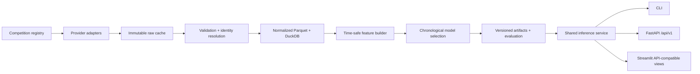

# Global Soccer Prediction Engine

A production-shaped, time-safe machine-learning platform for pre-match soccer probabilities. It
turns attributed provider data into reproducible features, chooses models on chronological
validation data, reports an untouched holdout, and serves structured predictions through a CLI,
FastAPI, and Streamlit.

> **Responsible use:** probabilities are uncertain model estimates for analytics and education.
> They are not facts, guarantees, or betting advice. Transfers, rare events, coaching changes,
> missing lineups, and incomplete provider data can materially reduce reliability.

## Why this problem is difficult

Soccer is low-scoring, draws are common, and a red card or deflection can dominate a match.
Provider identities and competition formats differ. Lineups arrive late. Most importantly, a model
can look excellent while accidentally using post-match statistics, future standings, or later
ratings. This project treats temporal provenance and calibration as first-class requirements.

## Architecture



The local implementation uses Parquet for columnar tables and DuckDB for analytical access. Domain
schemas and provider-neutral IDs keep a future PostgreSQL deployment straightforward. Competition
coverage is configured in [`configs/competitions.yaml`](configs/competitions.yaml), not embedded in
model code.

## Implemented capabilities (Phases 1–3)

- Match outcome probabilities: home win, draw, away win
- Independent Poisson expected goals and a normalized scoreline distribution
- Top-five likely scorelines, totals, both-teams-to-score, clean sheets, and expected margin
- Most-common, home-advantage, and Elo baselines
- Calibrated logistic regression and histogram gradient boosting candidates
- Chronological train/validation/test selection with a bootstrap interval for test log loss
- Strictly shifted rolling form for 3, 5, 10, and 20 matches, EWM form, rest, Elo, calendar, and
  neutral-venue features
- CLI, REST API, and a dark professional Streamlit dashboard
- Optional authenticated upcoming-fixture refresh from football-data.org
- Player-match ingestion for squad membership, positions, starts, minutes, shots, xG, goals,
  non-penalty goals, assists, penalties, and first scorers
- Cutoff-safe expected lineups, starting probabilities, and expected minutes based on prior squads
- Goalscorer and first-goalscorer probabilities with explicit player-level reliability labels
- Player Poisson intensities reconciled exactly to each team's expected-goals forecast
- Smoothed six-interval goal-timing probabilities learned only from earlier goal events
- Chronological scorer evaluation with log loss, Brier score, calibration error, threshold
  precision/recall, candidate coverage, and top-k hit rate
- A 39-competition configuration registry with explicit coverage states
- Incremental catalog processing for all 80 published StatsBomb competition-season indexes
- Conservative cross-provider identity resolution with ambiguous-match review
- Time-safe competition strength, opponent-adjusted form, promotion, tournament-context, and
  cross-season Elo carryover features
- Versioned `/api/v1` catalog, fixture, prediction, form, player, freshness, model, and health APIs
- Expanding-window, rolling-window, future-season, cross-league, and tournament evaluations
- Global coverage, fixtures, provider health, and cross-league dashboard pages

Award ranking remains a Phase 4 module. Its interface is present, but the application does not
invent outputs before cutoff-safe labels and candidate data exist.

## Data sources and licensing

| Source | Used now | Access | Purpose and conditions |
|---|---:|---|---|
| [StatsBomb Open Data](https://github.com/statsbomb/open-data) | Yes | Open repository | 3,961 match indexes from all 80 published competition-seasons; four WSL seasons include lineups/events. Attribution is required for published analysis; the upstream agreement controls. |
| [football-data.co.uk](https://www.football-data.co.uk/data.php) | Adapter | User-supplied CSV | Historical results parser. Files are not scraped or redistributed because an explicit redistribution license was not established; users must review current terms. |
| [football-data.org](https://www.football-data.org/) | Optional | API key; free plans may be available | Upcoming fixtures through the documented API. User must comply with current plan limits and terms. Responses are cached; no controls are bypassed. |
| [OpenLigaDB](https://www.openligadb.de/) | Interface | Public API | Adapter-ready declaration; no local records are claimed. |
| API-Football / Sportmonks | Interface | Licensed API keys | Credential-required boundaries; never enabled without applicable rights. |

The reproducible snapshot contains **3,961 unique matches, 24 observed competition names, and 80
competition-season pairs** from 1958-06-24 through 2025-07-27. Four WSL seasons contain **457
matches, 660 players, 16,593 player-match rows, and 1,432 goals**. This is not 200,000 records and
is not worldwide player coverage.

### Exact observed match coverage

| Competition | Matches | Seasons | Date range |
|---|---:|---:|---|
| 1. Bundesliga | 68 | 2 | 2015-08-15–2024-05-18 |
| African Cup of Nations | 52 | 1 | 2024-01-13–2024-02-11 |
| Champions League | 18 | 18 | 1971-06-02–2019-06-01 |
| Copa America | 32 | 1 | 2024-06-21–2024-07-15 |
| Copa del Rey | 3 | 3 | 1978-04-19–1984-05-05 |
| FA Women's Super League | 457 | 4 | 2018-09-09–2024-05-18 |
| FIFA U20 World Cup | 1 | 1 | 1979-09-07 |
| FIFA World Cup | 147 | 8 | 1958-06-24–2022-12-18 |
| Frauen Bundesliga | 132 | 1 | 2023-09-15–2024-05-20 |
| Indian Super league | 115 | 1 | 2021-11-19–2022-03-20 |
| La Liga | 867 | 18 | 1974-02-17–2021-05-16 |
| Liga F | 240 | 1 | 2023-09-15–2024-06-16 |
| Liga Profesional | 2 | 2 | 1981-04-10–1997-10-25 |
| Ligue 1 | 435 | 3 | 2015-08-07–2023-06-03 |
| Major League Soccer | 6 | 1 | 2023-08-27–2023-10-22 |
| NWSL | 173 | 2 | 2018-04-15–2023-11-12 |
| North American League | 1 | 1 | 1977-08-28 |
| Premier League | 418 | 2 | 2003-08-16–2016-05-17 |
| Serie A | 381 | 2 | 1986-11-09–2016-05-15 |
| Serie A Women | 130 | 1 | 2023-09-16–2024-05-19 |
| UEFA Euro | 102 | 2 | 2021-06-11–2024-07-14 |
| UEFA Europa League | 3 | 1 | 1989-03-15–1989-05-03 |
| UEFA Women's Euro | 62 | 2 | 2022-07-06–2025-07-27 |
| Women's World Cup | 116 | 2 | 2019-06-07–2023-08-20 |

Run `soccer-engine coverage --output reports/coverage.json` for the exact season labels, provider
capability, credentials, freshness, and limitations. “Partial” means a curated subset, not complete
competition history.

## Leakage prevention

Every match is processed in kickoff order. A team's feature state is read **before** the current
result updates its history. Elo is likewise captured before the match. Scheduled rows do not update
state. The main evaluation is never randomly shuffled: a 70% training block is followed by a 15%
validation block for champion selection and a final untouched 15% test block. Automated tests alter
current and future scores and verify earlier/current features do not change.

The system deliberately excludes final standings, end-of-season ratings, post-match event totals,
and future transfers. Penalty shootouts remain distinct from the modeled regulation/extra-time
outcome.

## macOS installation

Requirements: Homebrew and Python 3.11 or newer.

```bash
brew install python@3.11
python3.11 -m venv .venv
source .venv/bin/activate
python -m pip install --upgrade pip
pip install -e '.[dev]'
cp .env.example .env
```

## Quick start

Run the complete offline path—no API key or network call is required:

```bash
soccer-engine demo
soccer-engine dashboard
```

Or run each stage:

```bash
soccer-engine ingest --sample
soccer-engine normalize
soccer-engine ingest-player-data --sample
soccer-engine build-features
soccer-engine train
soccer-engine evaluate
soccer-engine coverage
soccer-engine predict --fixture-id statsbomb:3913082
soccer-engine serve-api
```

To reproduce the larger Phase 3 evaluations, download only the public assets from the official
StatsBomb repository. Downloads are cached and generated snapshots remain git-ignored:

```bash
python scripts/build_global_statsbomb_sample.py
python scripts/build_player_sample.py
soccer-engine ingest-global-sample
soccer-engine ingest-player-data --sample
soccer-engine build-features
soccer-engine train
soccer-engine evaluate-global
soccer-engine evaluate-scorers
```

For live schedules, obtain a football-data.org key, put it only in `.env`, and run:

```bash
soccer-engine update-fixtures --competition PL
soccer-engine fixtures --date 2026-09-19 --timezone America/New_York
soccer-engine predict-date --date 2026-09-19
```

## API example

```bash
curl http://127.0.0.1:8000/api/v1/predictions/statsbomb:3913082
```

The versioned API also exposes `/competitions`, `/seasons`, `/fixtures`, batch predictions, team and
player form, expected lineups, goalscorers, first goalscorers, goal timing, freshness, providers,
model versions, evaluation, health, and data quality beneath `/api/v1`.

```json
{
  "schema_version": "2.0",
  "fixture_id": "statsbomb:3913082",
  "competition": "FA Women's Super League",
  "outcome": {"home_win": 0.41, "draw": 0.27, "away_win": 0.32},
  "expected_home_goals": 1.54,
  "expected_away_goals": 1.23,
  "likely_scorelines": [
    {"home_goals": 1, "away_goals": 1, "probability": 0.12}
  ],
  "expected_lineups": [
    {"player_name": "Example Player", "starting_probability": 0.78, "expected_minutes": 71.2}
  ],
  "likely_goalscorers": [
    {"player_name": "Example Player", "scoring_probability": 0.24, "first_scorer_probability": 0.10, "reliability": "medium"}
  ],
  "goal_intervals": [
    {"interval": "0-15", "home_goal_probability": 0.19, "away_goal_probability": 0.14, "any_goal_probability": 0.30}
  ],
  "model_version": "0.3.0",
  "reliability": "medium",
  "warnings": ["Current injury and suspension data are unavailable; lineup probabilities use prior squads."]
}
```

Values above illustrate the schema; run the trained artifact for actual output. Outcome probabilities
are validated to sum to one.

## Model evaluation

`soccer-engine train` compares candidate validation log loss, refits the selected trainable model on
the full development period, and evaluates once on the chronological test block. The generated
`reports/evaluation.json` records row counts, exact periods, all baseline metrics, outcome accuracy,
balanced accuracy, log loss, multiclass Brier score, ranked probability score, calibration error,
goal MAE/RMSE/Poisson deviance, and a seeded 95% bootstrap interval for test log loss.

### Measured Phase 3 results

The primary chronological outcome holdout contains **793 matches** from **2023-10-07 through
2025-07-27**, after training on 3,168 earlier matches. Logistic regression produced **57.25%
accuracy**, **0.932 log loss** (seeded bootstrap 95% CI **0.903–0.970**), **0.546 multiclass Brier
score**, 0.190 ranked probability score, and 0.068 calibration error. Baseline log losses were 1.084
for fixed home advantage and 0.968 for Elo. This is an improvement on this exact holdout only—not a
general production claim. Five rolling 396-match windows produced log losses from 0.899 to 1.019;
13 leave-one-competition-out and tournament views are also generated.

The complete **2023/24 WSL scorer holdout** contains **132 matches and 6,008 candidate rows**, from
2023-10-01 through 2024-05-18, after goal-model training on 3,140 earlier matches. The heuristic
produced **0.187 log loss** (95% CI **0.172–0.203**), **0.0494 Brier score** (95% CI
**0.0447–0.0536**), 0.0087 calibration error, and 95.1% actual-scorer candidate coverage. Top-1,
top-3, top-5, and top-10 hit rates were 34.1%, 55.3%, 70.5%, and 84.1%. Baseline log losses were
0.215 historical-rate, 0.215 equal team-xG allocation, and 0.200 position allocation. Sparse labels
and single-competition coverage mean these results must not be generalized.

## Dashboard screenshots

Screenshots will be added after deployment. The dashboard includes global coverage, upcoming
fixtures, provider status, cross-league evaluation, predictions, lineups, scorers, timing, and
freshness.

## Development

```bash
make format
make lint
make typecheck
make test
make smoke
docker compose -f docker/compose.yaml up --build
```

Important logic lives in `src/soccer_engine`, never only in notebooks. Raw downloads, generated
Parquet, secrets, and model binaries are ignored by Git.

## Honest limitations

- The 3,961-match snapshot is curated and era-imbalanced, not a global population.
- Lineups are expectations inferred from earlier squads, not confirmed team sheets. Current injuries
  and suspensions remain unavailable.
- Player xG/shot coverage is limited to four WSL seasons. Match indexes do not imply locally
  ingested player records, and live providers require reviewed identity mappings.
- Independent Poisson goals do not yet model low-score correlation (Dixon–Coles is a roadmap item).
- Historical dashboard selections are time-safe replays, not claims that those matches are upcoming.
- football-data.org coverage, rate limits, and terms depend on the user's current account.
- Explanations describe associations the model used; they do not establish causation.

## Roadmap

1. **Awards:** historical labels, separate statistical and media-sentiment components, and a constrained
   Puskás interface that never fabricates video-quality scores.
2. **Production:** PostgreSQL, task orchestration, drift monitoring, SHAP/permutation reports, model
   cards, authentication, and deployed screenshots.

## Resume-ready bullets

- Engineered a provider-neutral soccer ML platform using Python, DuckDB, Parquet, scikit-learn,
  FastAPI, and Streamlit, with versioned schemas and reproducible CLI workflows.
- Implemented leakage-resistant sequential form and Elo features plus chronological champion selection
  against transparent probabilistic baselines.
- Built calibrated three-way outcome and Poisson scoreline inference with structured uncertainty,
  bootstrap evaluation, API validation, CI, and an offline real-data smoke test.

## Attribution

Offline demo match data: **StatsBomb Open Data**. If this project or derived analysis is published,
follow StatsBomb's current user agreement, explicitly state the data source, and use the StatsBomb
logo from its media pack as requested upstream.
