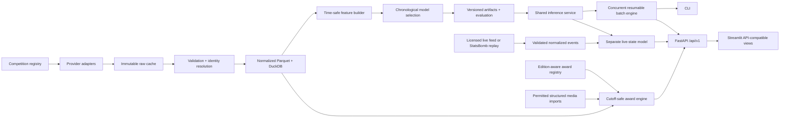

# Global Soccer Prediction Engine

A production-shaped, time-safe machine-learning platform for match probabilities, live-state
replay, and evidence-based award rankings. It turns attributed provider data into reproducible
features, uses chronological evaluation, and serves structured predictions through a CLI, FastAPI,
and Streamlit.

> **Responsible use:** probabilities are uncertain model estimates for analytics and education.
> They are not facts, guarantees, or betting advice. Transfers, rare events, coaching changes,
> missing lineups, and incomplete provider data can materially reduce reliability.

## Why this problem is difficult

Soccer is low-scoring, draws are common, and a red card or deflection can dominate a match.
Provider identities and competition formats differ. Lineups arrive late. Most importantly, a model
can look excellent while accidentally using post-match statistics, future standings, or later
ratings. This project treats temporal provenance and calibration as first-class requirements.

## Architecture



The local implementation uses Parquet for columnar tables and DuckDB for analytical access. Domain
schemas and provider-neutral IDs keep a future PostgreSQL deployment straightforward. Competition
coverage is configured in [`configs/competitions.yaml`](configs/competitions.yaml), not embedded in
model code.

### Award data model

The normalized award layer includes `awards`, `award_editions`, `award_rules`,
`award_candidates`, `official_nominees`, `official_results`, `official_vote_totals`,
`player_period_statistics`, `team_achievements`, `player_achievements`,
`journalist_rankings`, `media_mentions`, `sentiment_observations`, `goal_nominations`,
`award_predictions`, `award_prediction_snapshots`, and `award_evaluations`. Source, publication,
retrieval, and availability-cutoff timestamps are part of the validated ingestion contracts.
Snapshots are immutable JSON artifacts keyed by award, edition, and `as_of` timestamp.

## Implemented capabilities (Phases 1–4)

- Match outcome probabilities: home win, draw, away win
- Independent Poisson expected goals and a normalized scoreline distribution
- Top-five likely scorelines, totals, both-teams-to-score, clean sheets, and expected margin
- Most-common, home-advantage, and Elo baselines
- Calibrated logistic regression and histogram gradient boosting candidates
- Chronological train/validation/test selection with a bootstrap interval for test log loss
- Strictly shifted rolling form for 3, 5, 10, and 20 matches, EWM form, rest, Elo, calendar, and
  neutral-venue features
- CLI, REST API, and a dark professional Streamlit dashboard
- Optional authenticated upcoming-fixture refresh from football-data.org
- Player-match ingestion for squad membership, positions, starts, minutes, shots, xG, goals,
  non-penalty goals, assists, penalties, and first scorers
- Cutoff-safe expected lineups, starting probabilities, and expected minutes based on prior squads
- Goalscorer and first-goalscorer probabilities with explicit player-level reliability labels
- Player Poisson intensities reconciled exactly to each team's expected-goals forecast
- Smoothed six-interval goal-timing probabilities learned only from earlier goal events
- Chronological scorer evaluation with log loss, Brier score, calibration error, threshold
  precision/recall, candidate coverage, and top-k hit rate
- A 39-competition configuration registry with explicit coverage states
- Incremental catalog processing for all 80 published StatsBomb competition-season indexes
- Conservative cross-provider identity resolution with ambiguous-match review
- Time-safe competition strength, opponent-adjusted form, promotion, tournament-context, and
  cross-season Elo carryover features
- Versioned `/api/v1` catalog, fixture, prediction, form, player, freshness, model, and health APIs
- Expanding-window, rolling-window, future-season, cross-league, and tournament evaluations
- Global coverage, fixtures, provider health, and cross-league dashboard pages
- Concurrent, cached, resumable, and idempotent daily inference with per-fixture failure isolation
- Evidence-gated `full`, `standard`, `basic`, and `unavailable` prediction tiers
- A provider-neutral live-event contract with commentary parsing, correction/VAR handling, circuit
  breaking, feed latency, and explicit live/delayed/replay states
- A strictly sequential StatsBomb event replay simulator and clustered-bootstrap backtesting against
  static, time-decay, current-score Poisson, and event-count baselines
- Daily slate, batch progress, replay timeline, probability movement, pace, and pressure dashboards
- A 25-award, configuration-driven registry with 13 explicit edition rules
- Separate narrative/vote, scoring, tournament-best-player, and goal-award strategies
- Cutoff-filtered statistical, team-achievement, international, and optional media components
- Reproducible Golden Boot Monte Carlo simulation with shared-lead probabilities
- Edition-specific shared/assists/minutes tie rules and European Golden Shoe coefficients
- Immutable as-of snapshots, time-travel history, structured imports, API, CLI, dashboard, and
  chronological award evaluation
- Metadata-only Puskás support that never infers visual beauty from box-score data
- A rights-gated video-analysis protocol with no bundled implementation or implied video access

Global awards remain deliberately unavailable when a complete candidate pool is absent. The
included working statistical example is the WSL Golden Boot because that is the only locally
compatible multi-season player dataset; this is not presented as global player coverage.
Registry coverage is 5 narrative awards, 15 scoring awards, 4 tournament-best-player awards, and
1 goal award. At configuration level, 17 are partial, 5 unavailable, 1 credential-required,
1 statistical-only, and 1 metadata-only; runtime responses can downgrade when required evidence is
missing.

## Data sources and licensing

| Source | Used now | Access | Purpose and conditions |
|---|---:|---|---|
| [StatsBomb Open Data](https://github.com/statsbomb/open-data) | Yes | Open repository | 3,961 match indexes from all 80 published competition-seasons; four WSL seasons include lineups/events. Attribution is required for published analysis; the upstream agreement controls. |
| [football-data.co.uk](https://www.football-data.co.uk/data.php) | Adapter | User-supplied CSV | Historical results parser. Files are not scraped or redistributed because an explicit redistribution license was not established; users must review current terms. |
| [football-data.org](https://www.football-data.org/) | Optional | API key; free plans may be available | Upcoming fixtures through the documented API. User must comply with current plan limits and terms. Responses are cached; no controls are bypassed. |
| [OpenLigaDB](https://www.openligadb.de/) | Interface | Public API | Adapter-ready declaration; no local records are claimed. |
| API-Football / Sportmonks | Interface | Licensed API keys | Credential-required boundaries; never enabled without applicable rights. |
| [FIFA award publications](https://www.fifa.com/en/the-best-fifa-football-awards/2025/articles/voting-closed) and [UEFA/Ballon d'Or announcements](https://www.uefa.com/ballondor/news/029c-1e6c4428b07e-0926bc6b3468-1000--2025-ballon-d-or-awards-nominees-revealed/) | Registry references | Public official pages | Edition dates, voting structure, official nomination metadata, and rule verification only; no copyrighted article body is stored. |
| Structured award/media CSV | Optional | User-supplied attributed records | Official results, nominees, or permitted journalist rankings. The project does not scrape pages, bypass paywalls, or reproduce article text. |

The reproducible snapshot contains **3,961 unique matches, 24 observed competition names, and 80
competition-season pairs** from 1958-06-24 through 2025-07-27. Four WSL seasons contain **457
matches, 660 players, 16,593 player-match rows, and 1,432 goals**. This is not 200,000 records and
is not worldwide player coverage.

### Exact observed match coverage

| Competition | Matches | Seasons | Date range |
|---|---:|---:|---|
| 1. Bundesliga | 68 | 2 | 2015-08-15–2024-05-18 |
| African Cup of Nations | 52 | 1 | 2024-01-13–2024-02-11 |
| Champions League | 18 | 18 | 1971-06-02–2019-06-01 |
| Copa America | 32 | 1 | 2024-06-21–2024-07-15 |
| Copa del Rey | 3 | 3 | 1978-04-19–1984-05-05 |
| FA Women's Super League | 457 | 4 | 2018-09-09–2024-05-18 |
| FIFA U20 World Cup | 1 | 1 | 1979-09-07 |
| FIFA World Cup | 147 | 8 | 1958-06-24–2022-12-18 |
| Frauen Bundesliga | 132 | 1 | 2023-09-15–2024-05-20 |
| Indian Super league | 115 | 1 | 2021-11-19–2022-03-20 |
| La Liga | 867 | 18 | 1974-02-17–2021-05-16 |
| Liga F | 240 | 1 | 2023-09-15–2024-06-16 |
| Liga Profesional | 2 | 2 | 1981-04-10–1997-10-25 |
| Ligue 1 | 435 | 3 | 2015-08-07–2023-06-03 |
| Major League Soccer | 6 | 1 | 2023-08-27–2023-10-22 |
| NWSL | 173 | 2 | 2018-04-15–2023-11-12 |
| North American League | 1 | 1 | 1977-08-28 |
| Premier League | 418 | 2 | 2003-08-16–2016-05-17 |
| Serie A | 381 | 2 | 1986-11-09–2016-05-15 |
| Serie A Women | 130 | 1 | 2023-09-16–2024-05-19 |
| UEFA Euro | 102 | 2 | 2021-06-11–2024-07-14 |
| UEFA Europa League | 3 | 1 | 1989-03-15–1989-05-03 |
| UEFA Women's Euro | 62 | 2 | 2022-07-06–2025-07-27 |
| Women's World Cup | 116 | 2 | 2019-06-07–2023-08-20 |

Run `soccer-engine coverage --output reports/coverage.json` for the exact season labels, provider
capability, credentials, freshness, and limitations. “Partial” means a curated subset, not complete
competition history.

## Leakage prevention

Every match is processed in kickoff order. A team's feature state is read **before** the current
result updates its history. Elo is likewise captured before the match. Scheduled rows do not update
state. The main evaluation is never randomly shuffled: a 70% training block is followed by a 15%
validation block for champion selection and a final untouched 15% test block. Automated tests alter
current and future scores and verify earlier/current features do not change.

The system deliberately excludes final standings, end-of-season ratings, post-match event totals,
and future transfers. Penalty shootouts remain distinct from the modeled regulation/extra-time
outcome.

## macOS installation

Requirements: Homebrew and Python 3.11 or newer.

```bash
brew install python@3.11
python3.11 -m venv .venv
source .venv/bin/activate
python -m pip install --upgrade pip
pip install -e '.[dev]'
cp .env.example .env
```

## Quick start

Run the complete offline path—no API key or network call is required:

```bash
soccer-engine demo
soccer-engine dashboard
```

Or run each stage:

```bash
soccer-engine ingest --sample
soccer-engine normalize
soccer-engine ingest-player-data --sample
soccer-engine build-features
soccer-engine train
soccer-engine evaluate
soccer-engine coverage
soccer-engine predict --fixture-id statsbomb:3913082
soccer-engine serve-api
```

## Public cloud deployment

Both deployment targets use Python 3.11 and start from the repository root. Generated Parquet
tables, DuckDB files, reports, caches, and `models/champion.joblib` remain git-ignored. The cloud
startup workflow builds those artifacts from the attributed bundled sample instead of committing
them.

No secret is required for the credential-free historical dashboard, API health check, or offline
predictions. `FOOTBALL_DATA_ORG_API_KEY` and `LIVE_SOCCER_API_KEY` are optional and should only be
configured through the hosting provider's secret manager for legitimate provider access. Never
commit `.env` or `.streamlit/secrets.toml`.

### Streamlit Community Cloud

1. In Streamlit Community Cloud, create an app from
   `devrshah3/soccer-prediction-engine`, branch `main`.
2. Set the main file path to `streamlit_app.py` and select Python 3.11 in Advanced settings.
3. Deploy without secrets for offline mode. On the first launch, the app idempotently builds the
   132-match demonstration from committed StatsBomb sample data; this can take several seconds.
4. If licensed live integrations are later enabled, add optional keys in the app's Secrets panel:

   ```toml
   FOOTBALL_DATA_ORG_API_KEY = "..."
   LIVE_SOCCER_API_KEY = "..."
   ```

The root `requirements.txt` installs the local package and all dashboard dependencies declared in
`pyproject.toml`. `.streamlit/config.toml` supplies headless server and production theme settings.
When optional keys are absent, the dashboard explicitly identifies offline mode and unavailable
live-provider features.

Local equivalent:

```bash
streamlit run streamlit_app.py --server.headless true
```

### Render FastAPI service

Create a Render Blueprint from this repository. [`render.yaml`](render.yaml) defines a free Python
web service with:

```text
Build command: pip install --upgrade pip && pip install . && soccer-engine demo
Start command: uvicorn soccer_engine.api.app:app --host 0.0.0.0 --port $PORT
Health check: /api/v1/health
```

The build command creates the offline data and model artifacts on Render's build filesystem. The
start command honors Render's assigned `PORT`; no fixed public port is assumed. After deployment,
verify `https://<service-name>.onrender.com/api/v1/health`. Add optional provider credentials only
through Render environment variables.

Local equivalent:

```bash
PORT=8000 uvicorn soccer_engine.api.app:app --host 0.0.0.0 --port "$PORT"
curl http://127.0.0.1:8000/api/v1/health
```

To reproduce the larger Phase 3 evaluations, download only the public assets from the official
StatsBomb repository. Downloads are cached and generated snapshots remain git-ignored:

```bash
python scripts/build_global_statsbomb_sample.py
python scripts/build_player_sample.py
soccer-engine ingest-global-sample
soccer-engine ingest-player-data --sample
soccer-engine build-features
soccer-engine train
soccer-engine evaluate-global
soccer-engine evaluate-scorers
```

For live schedules, obtain a football-data.org key, put it only in `.env`, and run:

```bash
soccer-engine update-fixtures --competition PL
soccer-engine fixtures --date 2026-09-19 --timezone America/New_York
soccer-engine predict-date --date 2026-09-19
```

Daily inference can also run entirely from locally stored fixtures. Finished fixtures require the
explicit historical-replay switch so they cannot be mistaken for upcoming predictions:

```bash
soccer-engine predict-date --date 2015-12-05 --historical-replay --workers 8
soccer-engine predict-date --date 2015-12-05 --competition "Premier League" --historical-replay
soccer-engine batch-status --job-id 08601e2f8bd24a29
soccer-engine daily-summary --date 2015-12-05
```

Run an accelerated, leakage-safe historical live demonstration and its evaluation with:

```bash
soccer-engine live-replay --match-id statsbomb:3913185 --interval 10
soccer-engine evaluate-live-replay --limit 50 --interval 10
```

Real live mode is intentionally disabled without a contractually legitimate feed. Set
`LIVE_SOCCER_API_KEY` only for a reviewed adapter; the included offline replay requires no key.

Award coverage, historical rankings, and the reproducible scoring simulation are available with:

```bash
soccer-engine awards
soccer-engine award-coverage
soccer-engine rank-awards --award wsl_golden_boot --edition 2023/2024 --as-of 2024-03-02
soccer-engine simulate-golden-boot --competition WSL --season 2023/2024 --as-of 2024-03-02
soccer-engine evaluate-awards
soccer-engine import-award-candidates verified_candidates.csv
soccer-engine import-award-results verified_results.csv
soccer-engine import-media-rankings permitted_rankings.csv
soccer-engine import-goal-nominations official_goal_nominees.csv
```

`ballon_dor`, `fifa_best_men`, and other global awards return `unavailable` until a complete,
source-attributed candidate pool is imported. Missing media is reported as missing—not converted
to neutral or positive sentiment.

## API example

```bash
curl http://127.0.0.1:8000/api/v1/predictions/statsbomb:3913082
```

The versioned API also exposes `/competitions`, `/seasons`, `/fixtures`, team/player form, lineups,
scorers, timing, freshness, providers, models, evaluation, and health. Phase 3.5 adds
`POST /predictions/batch`, batch status, daily results/summary, live event/commentary ingestion,
live state/prediction/timeline reads, and `POST /live/replay/{match_id}`, all beneath `/api/v1`.
Phase 4 adds award catalog, definition, edition, candidate, ranking, prediction, leaderboard,
history, evaluation, media-observation, and recomputation routes under `/api/v1/awards`.

```bash
curl 'http://127.0.0.1:8000/api/v1/awards/wsl_golden_boot/rankings?edition=2023%2F2024&as_of=2024-03-02T00:00:00Z'
curl -X POST http://127.0.0.1:8000/api/v1/awards/recompute \
  -H 'Content-Type: application/json' \
  -d '{"award_id":"wsl_golden_boot","edition":"2023/2024","as_of":"2024-03-02T00:00:00Z","simulations":5000,"seed":42}'
```

```json
{
  "schema_version": "2.0",
  "fixture_id": "statsbomb:3913082",
  "competition": "FA Women's Super League",
  "outcome": {"home_win": 0.41, "draw": 0.27, "away_win": 0.32},
  "expected_home_goals": 1.54,
  "expected_away_goals": 1.23,
  "likely_scorelines": [
    {"home_goals": 1, "away_goals": 1, "probability": 0.12}
  ],
  "expected_lineups": [
    {"player_name": "Example Player", "starting_probability": 0.78, "expected_minutes": 71.2}
  ],
  "likely_goalscorers": [
    {"player_name": "Example Player", "scoring_probability": 0.24, "first_scorer_probability": 0.10, "reliability": "medium"}
  ],
  "goal_intervals": [
    {"interval": "0-15", "home_goal_probability": 0.19, "away_goal_probability": 0.14, "any_goal_probability": 0.30}
  ],
  "model_version": "0.4.0",
  "reliability": "medium",
  "warnings": ["Current injury and suspension data are unavailable; lineup probabilities use prior squads."]
}
```

Values above illustrate the schema; run the trained artifact for actual output. Outcome probabilities
are validated to sum to one.

## Model evaluation

`soccer-engine train` compares candidate validation log loss, refits the selected trainable model on
the full development period, and evaluates once on the chronological test block. The generated
`reports/evaluation.json` records row counts, exact periods, all baseline metrics, outcome accuracy,
balanced accuracy, log loss, multiclass Brier score, ranked probability score, calibration error,
goal MAE/RMSE/Poisson deviance, and a seeded 95% bootstrap interval for test log loss.

### Measured Phase 3 results

The primary chronological outcome holdout contains **793 matches** from **2023-10-07 through
2025-07-27**, after training on 3,168 earlier matches. Logistic regression produced **57.25%
accuracy**, **0.932 log loss** (seeded bootstrap 95% CI **0.903–0.970**), **0.546 multiclass Brier
score**, 0.190 ranked probability score, and 0.068 calibration error. Baseline log losses were 1.084
for fixed home advantage and 0.968 for Elo. This is an improvement on this exact holdout only—not a
general production claim. Five rolling 396-match windows produced log losses from 0.899 to 1.019;
13 leave-one-competition-out and tournament views are also generated.

The complete **2023/24 WSL scorer holdout** contains **132 matches and 6,008 candidate rows**, from
2023-10-01 through 2024-05-18, after goal-model training on 3,140 earlier matches. The heuristic
produced **0.187 log loss** (95% CI **0.172–0.203**), **0.0494 Brier score** (95% CI
**0.0447–0.0536**), 0.0087 calibration error, and 95.1% actual-scorer candidate coverage. Top-1,
top-3, top-5, and top-10 hit rates were 34.1%, 55.3%, 70.5%, and 84.1%. Baseline log losses were
0.215 historical-rate, 0.215 equal team-xG allocation, and 0.200 position allocation. Sparse labels
and single-competition coverage mean these results must not be generalized.

### Measured Phase 3.5 replay results

The live-state backtest replays **50 real 2023/24 WSL matches** from **2024-02-18 through
2024-05-18**, yielding **1,417 sequential snapshots**. Snapshots see only events already revealed;
95% intervals resample whole matches to account for within-match dependence. The event-state model
recorded 74.24% outcome accuracy, **0.601 log loss (95% CI 0.429–0.779)**, 0.341 multiclass Brier,
and 0.054 calibration error. Comparator log losses were 0.827 static pre-match, 0.711 time-decay,
0.618 current-score Poisson, and 0.669 event-count heuristic. The wide, overlapping intervals mean
this is preliminary evidence, not a proven improvement.

For goals within 5, 10, and 15 minutes, event-state Brier scores were **0.146, 0.210, and 0.232**;
clustered 95% intervals were 0.126–0.171, 0.193–0.229, and 0.217–0.246. Next-scoring-team accuracy
was 73.28% over 1,048 eligible snapshots. These observations come from one competition and are not
evidence of production live-feed performance.

### Measured Phase 4 award results

The only compatible local award evaluation is a statistics-derived WSL Golden Boot study—not an
official vote-label dataset. It evaluates **12 chronological snapshots across four editions**
(2018/19, 2019/20, 2020/21, and 2023/24), covering 2018-10-21 through 2024-03-24 and **2,787
candidate rows**. The transparent simulation achieved 58.3% top-one accuracy, 66.7% top-three hit
rate, 75.0% top-five hit rate, 0.668 mean reciprocal rank, 0.738 NDCG, 3.748 winner log loss, 0.698
multiclass Brier, 0.304 Spearman correlation, and 0.275 Kendall correlation. Its top-one accuracy
equals the goals-only and goal-contribution baselines; it does not demonstrate improvement.

The derived end-of-snapshot leaders are Vivianne Miedema (21) in 2018/19, Vivianne Miedema (16) in
2019/20, Vivianne Miedema and Samantha Kerr tied on 18 in 2020/21, and Khadija Shaw (21) in 2023/24.
These labels are reconstructed from the complete local StatsBomb event snapshot, not bundled
official award-result records.

Top-one accuracy was 25% at early snapshots and 75% at both midseason and late snapshots. Only four
editions exist, so bootstrap confidence intervals would be misleading. The very low candidate-row
calibration error is also dominated by many non-winning players and must not be read in isolation.

A 10,000-run 2023/24 WSL simulation as of 2024-03-02 ranked Khadija Shaw first: 14 observed goals,
4.55 expected additional goals, 18.55 projected goals, and an 84.73% winner probability. Lauren
James ranked second at 14.66%. These are historical replay estimates using incomplete availability
evidence, not contemporary predictions or betting advice.

## Dashboard screenshots

Screenshots will be added after deployment. The dashboard includes global coverage, upcoming and
daily fixtures, batch progress, tier coverage, provider status, cross-league evaluation,
predictions, lineups, scorers, timing, replay probability movement, event timelines, and feed
freshness warnings. Award Intelligence adds edition/as-of selectors, component leaderboards,
winner-probability charts, candidate comparison, snapshot history, completeness, attribution,
historical evaluation, and explicit metadata-only warnings.

## Development

```bash
make format
make lint
make typecheck
make test
make smoke
docker compose -f docker/compose.yaml up --build
```

Important logic lives in `src/soccer_engine`, never only in notebooks. Raw downloads, generated
Parquet, secrets, and model binaries are ignored by Git.

## Honest limitations

- The 3,961-match snapshot is curated and era-imbalanced, not a global population.
- Lineups are expectations inferred from earlier squads, not confirmed team sheets. Current injuries
  and suspensions remain unavailable.
- Player xG/shot coverage is limited to four WSL seasons. Match indexes do not imply locally
  ingested player records, and live providers require reviewed identity mappings.
- Independent Poisson goals do not yet model low-score correlation (Dixon–Coles is a roadmap item).
- Historical dashboard selections are time-safe replays, not claims that those matches are upcoming.
- football-data.org coverage, rate limits, and terms depend on the user's current account.
- No licensed live provider is bundled. `LIVE_SOCCER_API_KEY` is a protected adapter boundary, not a
  claim of live coverage; the dashboard labels cached StatsBomb demonstrations as replay.
- Live coefficients are currently transparent heuristics evaluated on 50 WSL matches. They require
  broader competition data, probability calibration, and prospective validation before production
  claims.
- No complete Ballon d'Or, FIFA, UEFA, confederation, or global Golden Boot candidate corpus is
  bundled. Those awards return unavailable, partial, or credential-required responses rather than
  invented probabilities.
- Historical award labels are not bundled. The WSL evaluation derives final scoring leaders from
  the compatible StatsBomb snapshot and does not call them official vote totals.
- Goalkeeper/defender normalization is supported for imported evidence, but reliable defensive
  features are too sparse for current global award predictions.
- Puskás rankings are metadata/sentiment-only until a legitimate licensed video-analysis pipeline
  exists; visual beauty and difficulty are never fabricated.
- Explanations describe associations the model used; they do not establish causation.

## Roadmap

1. **Phase 5 deployment:** move snapshots and jobs to PostgreSQL/object storage, add authenticated
   background workers, signed provider webhooks, observability, drift monitoring, and model cards.
2. **Licensed expansion:** ingest verified official award labels, complete player/trophy datasets,
   permitted media APIs, and—only if rights allow—a separately validated video-analysis service.

## Resume-ready bullets

- Engineered a provider-neutral soccer ML platform using Python, DuckDB, Parquet, scikit-learn,
  FastAPI, and Streamlit, with versioned schemas and reproducible CLI workflows.
- Implemented leakage-resistant sequential form and Elo features plus chronological champion selection
  against transparent probabilistic baselines.
- Built calibrated three-way outcome and Poisson scoreline inference with structured uncertainty,
  bootstrap evaluation, API validation, CI, and an offline real-data smoke test.
- Designed an edition-aware award engine with cutoff-safe component rankings, reproducible scoring
  simulations, immutable time-travel snapshots, and honest unavailable/metadata-only fallbacks.

## Attribution

Offline demo match data: **StatsBomb Open Data**. If this project or derived analysis is published,
follow StatsBomb's current user agreement, explicitly state the data source, and use the StatsBomb
logo from its media pack as requested upstream.
