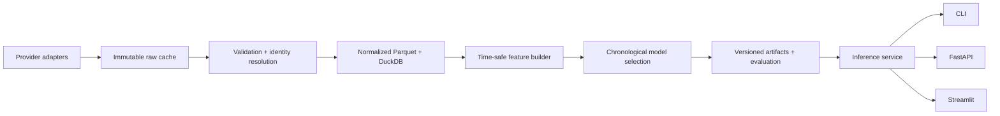

# Global Soccer Prediction Engine

A production-shaped, time-safe machine-learning platform for pre-match soccer probabilities. It
turns attributed provider data into reproducible features, chooses models on chronological
validation data, reports an untouched holdout, and serves structured predictions through a CLI,
FastAPI, and Streamlit.

> **Responsible use:** probabilities are uncertain model estimates for analytics and education.
> They are not facts, guarantees, or betting advice. Transfers, rare events, coaching changes,
> missing lineups, and incomplete provider data can materially reduce reliability.

## Why this problem is difficult

Soccer is low-scoring, draws are common, and a red card or deflection can dominate a match.
Provider identities and competition formats differ. Lineups arrive late. Most importantly, a model
can look excellent while accidentally using post-match statistics, future standings, or later
ratings. This project treats temporal provenance and calibration as first-class requirements.

## Architecture



The local implementation uses Parquet for columnar tables and DuckDB for analytical access. Domain
schemas and provider-neutral IDs keep a future PostgreSQL deployment straightforward. Competition
coverage is configured in [`configs/competitions.yaml`](configs/competitions.yaml), not embedded in
model code.

## Phase 1 capabilities

- Match outcome probabilities: home win, draw, away win
- Independent Poisson expected goals and a normalized scoreline distribution
- Top-five likely scorelines, totals, both-teams-to-score, clean sheets, and expected margin
- Most-common, home-advantage, and Elo baselines
- Calibrated logistic regression and histogram gradient boosting candidates
- Chronological train/validation/test selection with a bootstrap interval for test log loss
- Strictly shifted rolling form for 3, 5, 10, and 20 matches, EWM form, rest, Elo, calendar, and
  neutral-venue features
- CLI, REST API, and a dark professional Streamlit dashboard
- Optional authenticated upcoming-fixture refresh from football-data.org

Player/lineup goal-scorer models, timing models, global provider expansion, and award ranking are
explicit later phases. Their interfaces are present, but the application does not invent outputs
before appropriate data is available.

## Data sources and licensing

| Source | Used now | Access | Purpose and conditions |
|---|---:|---|---|
| [StatsBomb Open Data](https://github.com/statsbomb/open-data) | Yes | Open repository | Real 2023/24 FA Women's Super League match index for the offline demo, plus a Bundesliga provider fixture. StatsBomb permits public research/genuine-interest use and requires source attribution and its logo when publishing derived research. The upstream user agreement remains controlling. |
| [football-data.org](https://www.football-data.org/) | Optional | API key; free plans may be available | Upcoming fixtures through the documented API. User must comply with current plan limits and terms. Responses are cached; no controls are bypassed. |
| API-Football / Sportmonks | Adapter roadmap | Licensed API keys | Never enabled or scraped without user credentials and applicable rights. |

The default bundled 132-row match index is copied unchanged from StatsBomb's public repository,
includes source IDs, and exists only to make tests and the demo reproducible offline. The repository does **not**
claim 200,000 records; scale claims will be added only after measured ingestion.

## Leakage prevention

Every match is processed in kickoff order. A team's feature state is read **before** the current
result updates its history. Elo is likewise captured before the match. Scheduled rows do not update
state. The main evaluation is never randomly shuffled: a 70% training block is followed by a 15%
validation block for champion selection and a final untouched 15% test block. Automated tests alter
current and future scores and verify earlier/current features do not change.

The system deliberately excludes final standings, end-of-season ratings, post-match event totals,
and future transfers. Penalty shootouts remain distinct from the modeled regulation/extra-time
outcome.

## macOS installation

Requirements: Homebrew and Python 3.11 or newer.

```bash
brew install python@3.11
python3.11 -m venv .venv
source .venv/bin/activate
python -m pip install --upgrade pip
pip install -e '.[dev]'
cp .env.example .env
```

## Quick start

Run the complete offline path—no API key or network call is required:

```bash
soccer-engine demo
soccer-engine dashboard
```

Or run each stage:

```bash
soccer-engine ingest --sample
soccer-engine normalize
soccer-engine build-features
soccer-engine train
soccer-engine evaluate
soccer-engine predict --fixture-id statsbomb:3913168
soccer-engine serve-api
```

For live schedules, obtain a football-data.org key, put it only in `.env`, and run:

```bash
soccer-engine update-fixtures --competition PL
soccer-engine predict-date --date 2026-09-19
```

## API example

```bash
curl http://127.0.0.1:8000/predictions/statsbomb:3913168
```

```json
{
  "schema_version": "1.0",
  "fixture_id": "statsbomb:3913168",
  "competition": "1. Bundesliga",
  "outcome": {"home_win": 0.41, "draw": 0.27, "away_win": 0.32},
  "expected_home_goals": 1.54,
  "expected_away_goals": 1.23,
  "likely_scorelines": [
    {"home_goals": 1, "away_goals": 1, "probability": 0.12}
  ],
  "model_version": "0.1.0",
  "reliability": "medium",
  "warnings": ["Lineup, injury, and suspension data are unavailable in the Phase 1 source."]
}
```

Values above illustrate the schema; run the trained artifact for actual output. Outcome probabilities
are validated to sum to one.

## Model evaluation

`soccer-engine train` compares candidate validation log loss, refits the selected trainable model on
the full development period, and evaluates once on the chronological test block. The generated
`reports/evaluation.json` records row counts, exact periods, all baseline metrics, outcome accuracy,
balanced accuracy, log loss, multiclass Brier score, ranked probability score, calibration error,
goal MAE/RMSE/Poisson deviance, and a seeded 95% bootstrap interval for test log loss.

No accuracy improvement is claimed in this README. The single-season open sample is useful for
engineering validation, not a global performance conclusion.

### Measured offline demo result

On the untouched **20-match** FA Women's Super League holdout from **2024-04-21 15:15 UTC through
2024-05-18 17:00 UTC**, the calibrated logistic model produced 50.0% accuracy, 0.989 log loss
(seeded bootstrap 95% CI: 0.791–1.258), a 0.572 multiclass Brier score, and 0.230 calibration error.
The Poisson goal model produced 0.953 MAE and 1.295 RMSE across home and away goals.

The logistic model's log loss was lower than the most-common-class and fixed home-advantage
baselines, but **higher (worse) than the Elo baseline's 0.947**. Therefore Phase 1 does not establish
an improvement over the strongest baseline. The holdout is small, and these figures must not be
generalized beyond this exact dataset and period. Reproduce the complete report with
`soccer-engine evaluate`.

## Dashboard screenshots

Screenshots will be added after the UI is deployed. The current dashboard includes fixture replay,
outcome cards, likely scorelines, totals context, model performance, data freshness, and an honest
award-module status.

## Development

```bash
make format
make lint
make typecheck
make test
make smoke
docker compose -f docker/compose.yaml up --build
```

Important logic lives in `src/soccer_engine`, never only in notebooks. Raw downloads, generated
Parquet, secrets, and model binaries are ignored by Git.

## Honest limitations

- The offline sample covers one Bundesliga season and contains match metadata/results, not a global
  population.
- Phase 1 has no lineup, player, injury, xG, odds, travel, or manager-change inputs.
- Independent Poisson goals do not yet model low-score correlation (Dixon–Coles is a roadmap item).
- Historical dashboard selections are time-safe replays, not claims that those matches are upcoming.
- football-data.org coverage, rate limits, and terms depend on the user's current account.
- Explanations describe associations the model used; they do not establish causation.

## Roadmap

1. **Player and scorer modeling:** cutoff-safe lineups, starts/minutes, scorer allocation consistent
   with team xG, interval intensities, and missing-data reliability.
2. **Global expansion:** additional licensed adapters, stronger identity resolution, scheduled refresh,
   cross-league/season/tournament evaluation, and scale benchmarks.
3. **Awards:** historical labels, separate statistical and media-sentiment components, and a constrained
   Puskás interface that never fabricates video-quality scores.
4. **Production:** PostgreSQL, task orchestration, drift monitoring, SHAP/permutation reports, model
   cards, authentication, and deployed screenshots.

## Resume-ready bullets

- Engineered a provider-neutral soccer ML platform using Python, DuckDB, Parquet, scikit-learn,
  FastAPI, and Streamlit, with versioned schemas and reproducible CLI workflows.
- Implemented leakage-resistant sequential form and Elo features plus chronological champion selection
  against transparent probabilistic baselines.
- Built calibrated three-way outcome and Poisson scoreline inference with structured uncertainty,
  bootstrap evaluation, API validation, CI, and an offline real-data smoke test.

## Attribution

Offline demo match data: **StatsBomb Open Data**. If this project or derived analysis is published,
follow StatsBomb's current user agreement, explicitly state the data source, and use the StatsBomb
logo from its media pack as requested upstream.
